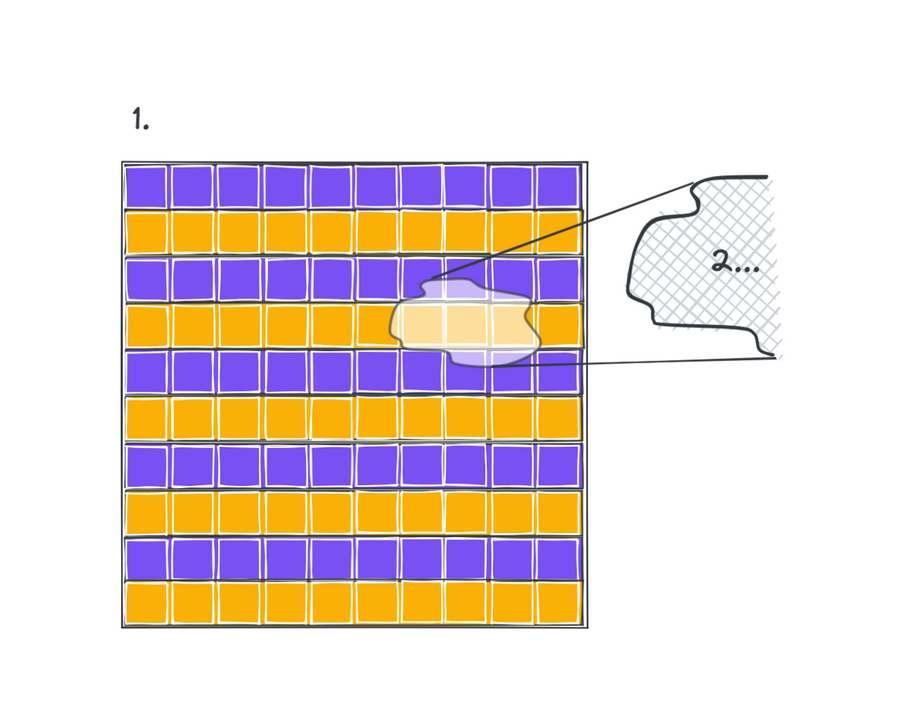
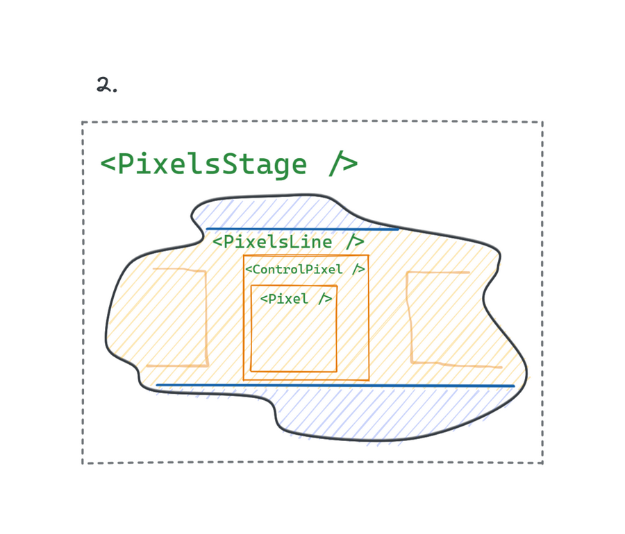

# Comparing the performance of state management solutions for React

> This is a description and guide for the application hosted on
> [turtleflyer.github.io/compare-react-state-management-solutions/](https://turtleflyer.github.io/compare-react-state-management-solutions/)

The objective of this project is to compare the performance of the
[*use-interstate*](https://github.com/turtleflyer/use-interstate) library with the popular state
management libraries for *React*, namely *Redux* and *Recoil*. If you don't know about
[*use-interstate*](https://github.com/turtleflyer/use-interstate), it is an unopinionated state
management solution for *React* that leans to be as simple as the standard hook `useState` but also
to have a purpose to share the state between components that effectively means - to provide the
ability to update and subscribe to that state. You can think about it as a reliable alternative to
*Context Provider* but being simpler for introducing inside the components and having the ability to
dynamically change the subscription at any moment. It opens many opportunities for using
[*use-interstate*](https://github.com/turtleflyer/use-interstate) in custom libraries and
architectural solutions as an elementary unit. In this case, the performance of
[*use-interstate*](https://github.com/turtleflyer/use-interstate) should be reckoned as a vital
quality.

## How we measure the performance

> This application is
> [compatible](https://developer.mozilla.org/en-US/docs/Web/API/PerformanceLongTaskTiming#browser_compatibility)
> with the browsers supporting
> [*PerformanceLongTaskTiming*](https://developer.mozilla.org/en-US/docs/Web/API/PerformanceLongTaskTiming)
> interface.

All measurements reveal through two values - [TTI (Total Time to Interactive)](https://web.dev/tti/)
and [TBT (Total Blocking Time)](https://web.dev/tbt/). The meaning of both values is very close to
those of [the values in the Performance section of the Lighthouse
report](https://web.dev/interactive/). The only difference is TTI in that report measures the time
from the moment when the page starts loading. Our measurements start from the moment when the user's
interaction, giving the particular command, fires.

## Test model

Our testing *React* application is a square matrix of pixels arranged by rows

Every `Pixel` component is wrapped into `ControlPixel` that is a part of `PixelsLine` and
subsequentially of `PixelsStage`

To introduce extra complexity to the components tree the rest of the lines on every stage are
wrapped in the `div` element. It forms an unbalanced DOM tree of the lines of the pixels but
visually remains a square grid.

## Test logic

This is a logical diagram of the application

Any `Pixel` component has a prop `alternative` which is bound to a global state record that holds
the value of some color. That means any pixel is subscribed to some "alternative". `ControlPixel` in
its turn is subscribed to a "choice" that is binary. It is the key that holds the name of the
"alternative" or `null` value. If the "choice" retains a `null`, then the controlled `Pixel` gets
missed - the "choice" is disabled. Otherwise, it makes `Pixel` subscribe to the color correlated
with the "alternative" name it belongs to. It introduces the test model with the dynamic
subscription. In the beginning, each row has its default "choice", and every "choice" of two holds a
different "alternative". The row of the "choice" 0 follows the "choice" 1.

There are several test commands to measure the performance:

* **Re-paint.** It changes the color value for the "alternative". Visually each `Pixel` component
  subscribed to this "alternative" gets notified about the change and switches the appearance. Every
  next command alters the next "alternative".

* **Disable row.** One "choice" gets the value `null`. Every `ControlPixel` subscribed to this
  "choice" disables controlled `Pixel`. Visually the pixels of one color disappear.

* **Enable row.** If the `Pixel` components of one "choice" were disabled, this command "enable"
  them through `ControlPixel` giving that "choice" brand new "alternative". In this case, the app
  state creates a record for the new "alternative" key with the new color value.

* **Paint random pixel.** The command picks a random `ControlPixel` and dynamically changes its
  "choice" effectively repainting the controlled `Pixel`.

* **Paint n% random pixels.** The same as previous but picking the defined percentage of pixels.

* **Change grid.** Re-render the whole `PixelsStage` building the new grid of the defined size. The
  command flushes out the app state completely initializing the new one. It performs two separate
  measurements: for unmounting the old grid, and subsequently for building a new one.

## Performing measurements and stats

The test app does not provide an automated way of evaluating the performance. The user must give the
commands manually. After each command, the UI gets blocked for at least 5 sec. It is because TTI is
a value that counts the busy time until the UI becomes responsive again for the earliest 5 sec.

As soon as the measurement is registered, it gets reflected in the stat tab contributing to the
calculation of the average value for the command. After several attempts, the user can compare stats
for different libraries. The number of attempts reads in the stat table.
